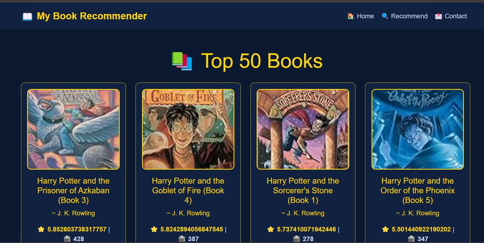
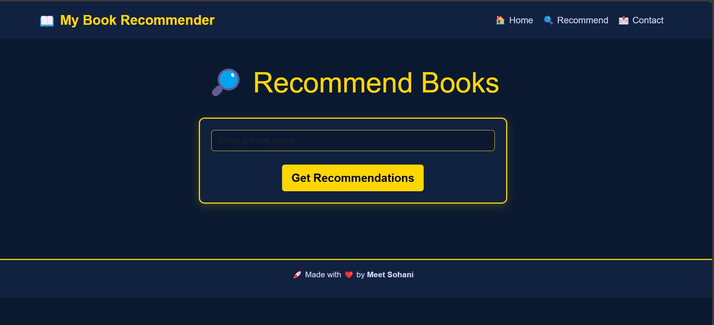
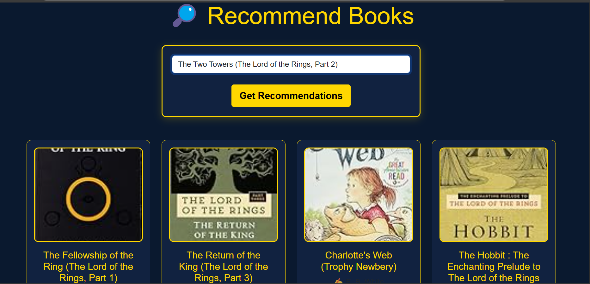

# My Book Recommender

## 📚 Overview

This is a **Book Recommendation System** that suggests books to users based on their preferences. The project utilizes **Collaborative Filtering** and **Popularity-Based Recommendation System** to provide personalized book recommendations. The web application has been developed using **Jupyter Notebook** for machine learning and data processing.

## 🔥 Features

- **Top 50 Books**: Displays the most popular books based on ratings.
- **Book Search**: Users can search for books to get recommendations.
- **Personalized Recommendations**: Based on collaborative filtering and popularity-based models.
- **User-Friendly UI**: A simple and attractive web interface.

## 🛠️ Technologies Used

- **Machine Learning Models**: Collaborative Filtering, Popularity-Based Recommender System
- **Libraries Used**:
  - Pandas, NumPy (Data Processing)
  - Scikit-Learn (ML Algorithms)
  - Streamlit / Flask (Web Interface if applicable)
- **Jupyter Notebook** (Development Environment)
- **GitHub** (Version Control)

## 📌 Installation and Usage

Follow these steps to set up and run the project:

### 1️⃣ Clone the Repository

```sh
git clone https://github.com/meet-159/book-recommender-ML-Project.git
cd book-recommender-ML-Project
```

### 2️⃣ Install Dependencies

Make sure you have Python installed. Then install the required libraries:

```sh
pip install pandas numpy scikit-learn streamlit
```

### 3️⃣ Run the Jupyter Notebook

```sh
jupyter notebook
```

Open the notebook and run all the cells to train the model.

### 4️⃣ Launch the Web App (if applicable)

If using **Streamlit**:

```sh
streamlit run app.py
```

If using **Flask**:

```sh
python app.py
```

## 🔍 Machine Learning Approach

### 1️⃣ Popularity-Based Recommendation System

- Recommends books based on overall popularity (highest-rated books with the most interactions).
- Suitable for new users who haven't provided any preferences.

### 2️⃣ Collaborative Filtering

- Uses user-book interaction data to recommend books based on similarity to other users.
- Helps provide **personalized** recommendations.
- Implemented using **K-Nearest Neighbors (KNN)**.

## 🎯 How to Use

1. **Explore Top Books**: Check out the most popular books.
2. **Search for a Book**: Enter a book title to get recommendations.
3. **Get Recommendations**: The system suggests similar books based on your input.

## 📌 Screenshots

Below are some screenshots of the project:





## ✨ Author

Developed with ❤️ by **Meet Sohani** 🚀
